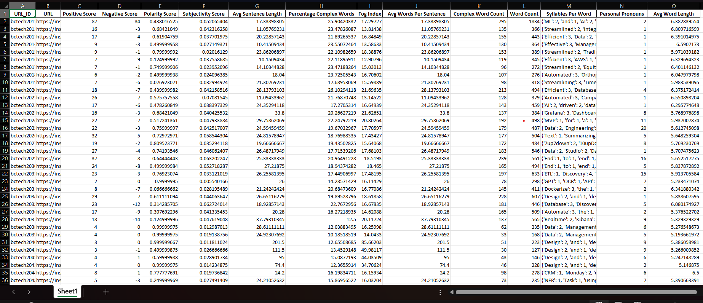

# Data Extraction and NLP

## Approach to Solution

### Introduction
The project is to develop a python script that can extract data from a given URL which is provided as an `Input.xlsx` file. Through this script, it will calculate various metrics such as positive and negative scores, polarity and subjectivity scores, readability indices like the Fog Index, and word/sentence complexity. The script will also generate a summary of the extracted data and store the results in an `Output.xlsx` file.
### Overview
The project is divided into the following modules:
1. Reading and Initializing Stop Words 
2. Web Scraping and Data Extraction 
3. Text Cleaning and Tokenization 
4. Syllable Counting and Complexity Analysis
5. Sentiment and Readability Analysis
6. Saving Results to an Output File

### Module 1: Reading and Initializing Stop Words
The first step is to read the stop words from the `stop_words.txt files` and store them in a list. This list will be used to remove the stop words from the extracted text. 

### Module 2: Web Scraping and Data Extraction
Here it used `Selenium WebDriver` to automate the browser, then it reads the `Input.xlsx` file to get the URLs. It then extracts the text from the given URL and stores it in a dictionary.
Here error handling is done for the invalid URLs.

### Module 3: Text Cleaning and Tokenization
Extracted text is cleaned by removing special characters, numbers, and stop words. The cleaned text is then tokenized into words and sentences using the `NLTK Library`, where I used the `nltk.word_tokenize` and `nltk.sent_tokenize` functions. 
sent_tokenize is used to split a text into sentences. word_tokenize is used to split a text into words.    

### Module 4: Syllable Counting and Complexity Analysis
Here the script calculates the number of syllables in each word and sentence. It then checks the complexity of the text based on the number of syllables in words and sentences.

### Module 5: Sentiment and Readability Analysis
Here the script calculates the sentiment scores such as positive and negative scores, polarity, and subjectivity scores etc. It also performs the readability analysis by calculating the Fog Index and other metrics.

### Module 6: Saving Results to an Output File
Finally, the script stores the results in an `output.xlsx` file. Where it used `Pandas` library to create a DataFrame and then save it to an Excel file.

### Output
Output is retrieved in this format:
 

### Conclusion
The script uses various libraries such as `Selenium`, `NLTK`, and `Pandas` for web scraping, text processing, and data manipulation respectively. It provides a comprehensive analysis of the extracted text in terms of sentiment, readability, and complexity. The results are stored in an output file for further analysis and reporting.


## How to run the .py file to generate output file?
### Installation
1. Install the required libraries using the following command:
```bash
pip install pandas selenium nltk openpyxl
```
2. Put the file path of the `Input.xlsx` file
3. Open the terminal or cmd and navigate to the directory of the `main.py` file.
4. Run the `main.py` file using the following command:
```bash
python main.py
```
5. The script will extract data from the given URLs and store the results in an `Output.xlsx` file.

## All required dependencies
- pandas
- selenium
- nltk
- openpyxl
